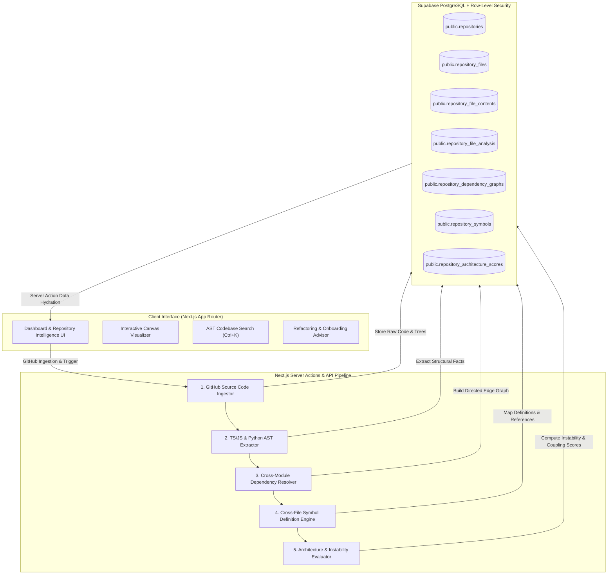
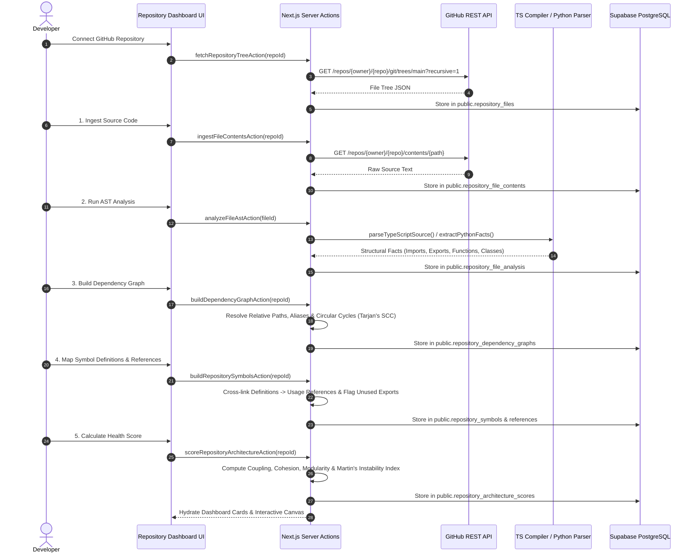

# 🔍 RepoLens — Modern Codebase Intelligence & Architectural Analytics Platform

> **RepoLens** is a deterministic, AST-powered codebase intelligence platform designed to help developers, architects, and engineering teams understand, navigate, and refactor complex software repositories without AI hallucinations or heavy cloud compute dependencies.

---

## 📌 Executive Summary & Problem Statement

As software codebases grow in scale and contributor density, engineering teams face significant architectural debt:
- **Opaque Dependency Graphs**: Files import dozens of internal utilities and third-party packages with no clear visual representation of module boundaries or coupling.
- **Silent Architectural Decay**: Circular dependency loops, layer boundary violations (e.g. database logic imported directly inside client UI components), and unused exports accumulate silently over time.
- **High Onboarding Friction**: New engineers waste days tracing root layout entry points, auth flows, and core domain schemas across hundreds of directory trees.
- **AI Coding Assistant Noise**: Passing entire unindexed raw file trees into LLMs (ChatGPT, Claude, Cursor) wastes token budgets, introduces noise, and triggers hallucinated code references.

**RepoLens solves this** by executing deterministic Abstract Syntax Tree (AST) parsing, cross-file symbol mapping, dependency graph resolution, and Martin's Instability Index analytics locally — delivering 100% fact-grounded intelligence.

---

## 🏗️ High-Level System Architecture

---

## 🔄 5-Step Pipeline Data Flow

RepoLens operates through a 5-step sequential intelligence pipeline:

---

## 🗄️ Database Design & Supabase RLS Schema

RepoLens leverages Supabase PostgreSQL with strict Row-Level Security (RLS) policies guaranteeing total multi-tenant user data isolation:

| Database Table | Primary Responsibility | Key Foreign Keys & Indexes |
| :--- | :--- | :--- |
| `public.profiles` | User profile metadata (username, avatar, GitHub ID) | `id` &rarr; `auth.users.id` |
| `public.repositories` | Connected GitHub repositories & branch metadata | `user_id` &rarr; `auth.users.id` |
| `public.repository_files` | Hierarchical file tree records (`path`, `type`, `size`) | `repository_id` &rarr; `repositories.id` |
| `public.repository_file_contents` | Compressed raw source code text | `repository_file_id` &rarr; `repository_files.id` |
| `public.repository_file_analysis` | Deterministic AST JSON facts (imports, exports, functions) | `repository_file_id` &rarr; `repository_files.id` |
| `public.repository_dependency_graphs` | Graph topology, nodes array, directed edge pairs | `repository_id` &rarr; `repositories.id` |
| `public.repository_symbols` | Unique symbol definitions (functions, components, classes) | `defining_file_id` &rarr; `repository_files.id` |
| `public.repository_symbol_references` | Cross-file symbol consumption links | `symbol_id` &rarr; `repository_symbols.id` |
| `public.repository_architecture_scores` | Coupling, cohesion, modularity, and instability metrics | `repository_id` &rarr; `repositories.id` |

---

## ⚡ Core Platform Features

1. **📊 Overview & Health Dashboard**:
   - Pipeline Stepper status bar.
   - Interactive sub-score cards for **Coupling**, **Cohesion**, **Modularity**, and **Martin's Instability Index** ($I = \frac{C_e}{C_a + C_e}$) with 1-click mathematical definition modals.

2. **🕸️ Dependency Network Canvas**:
   - High-performance interactive SVG dependency graph visualizer.
   - Fan-In / Fan-Out metrics, ring/column layout modes, and live node selection.

3. **🧩 Symbols & AI Refactoring Advisor**:
   - Cross-file symbol definition and usage mapping with unused export detection.
   - **Refactoring Advisor**: Ranks technical debt into `CRITICAL`, `HIGH`, `MEDIUM`, and `LOW` priorities.
   - **AI Context Payload Generator**: 1-click copyable noise-free AST context markdown formatted specifically for ChatGPT, Claude, and Cursor.

4. **📁 File Tree & Source Code Inspector**:
   - Tree navigator with syntax-highlighted source viewer and line numbers.
   - **Change Impact & Blast Radius Analyzer**: Calculates exact affected files and downstream risks before making code changes.

5. **🔍 Command Bar Search (`Ctrl + K`)**:
   - Instant AST-aware symbol and codebase search with kind filter pills (`all`, `function`, `component`, `class`, `variable`, `exportedOnly`).

6. **🧭 5-Minute Guided Repository Onboarding Tour**:
   - Step-by-step tour highlighting central entry points, domain schemas, auth engines, and server actions.

---

## 🛡️ Security & Privacy Assurance

- **100% Tenant Isolation**: Supabase Row-Level Security (RLS) policies enforce that users can only query and mutate repositories associated with their authenticated `auth.uid()`.
- **Token Protection**: GitHub OAuth provider tokens are handled exclusively inside server-side Next.js Server Actions and never exposed to client-side DOM bundles.
- **Graceful Rate Limiting**: Automatic fallback to unauthenticated public REST endpoints when GitHub API rate limits are approached.

---

## ⚠️ Known Limitations & Future Scope

### Current Limitations
- **Language Support**: Native AST parsing is fully optimized for TypeScript, JavaScript, JSX, TSX, and Python (`.py`). Other languages (Rust, Go, C++) use lightweight structural pattern matching.
- **Monorepo Workspaces**: Multi-package monorepo root aliases (lerna, pnpm workspaces) are resolved as external modules unless explicit relative paths are defined.

### Future Scope & Roadmap
- [ ] **Tree-Sitter WebAssembly Parser**: Multi-language AST parsing engine for Rust, Go, Java, and C++.
- [ ] **Automated GitHub PR Bot**: Comment change-impact analysis reports directly on GitHub Pull Requests.
- [ ] **Git History Instability Heatmaps**: Overlay Git commit churn frequency against architectural instability scores.

---

## 📜 License

Distributed under the MIT License. See `LICENSE` for more information.
